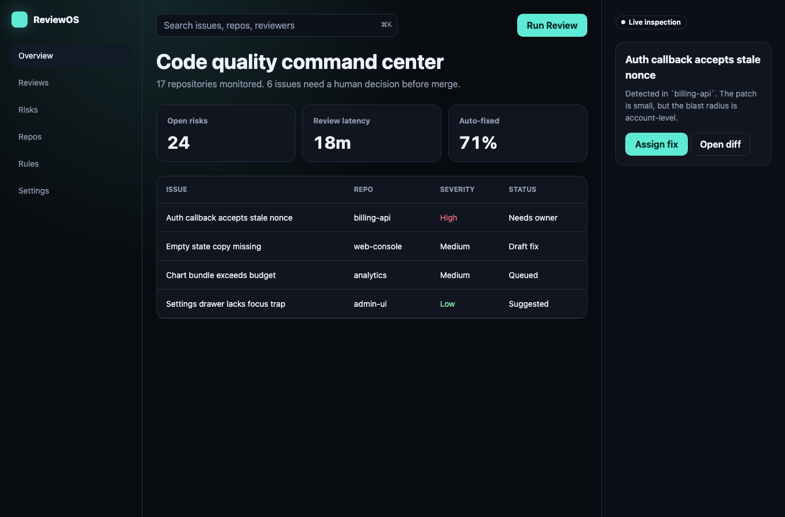
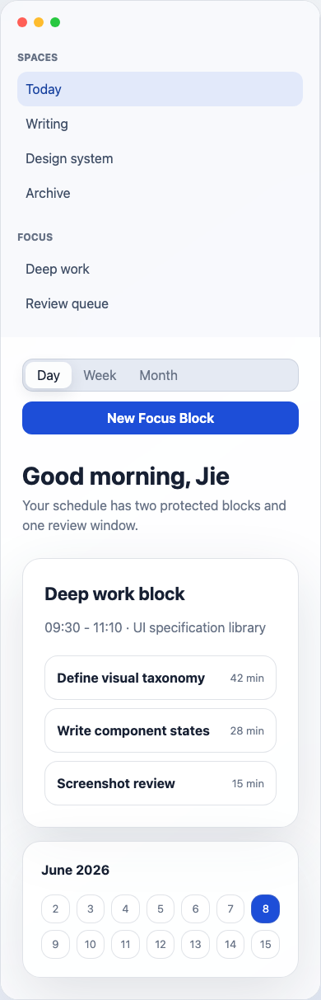
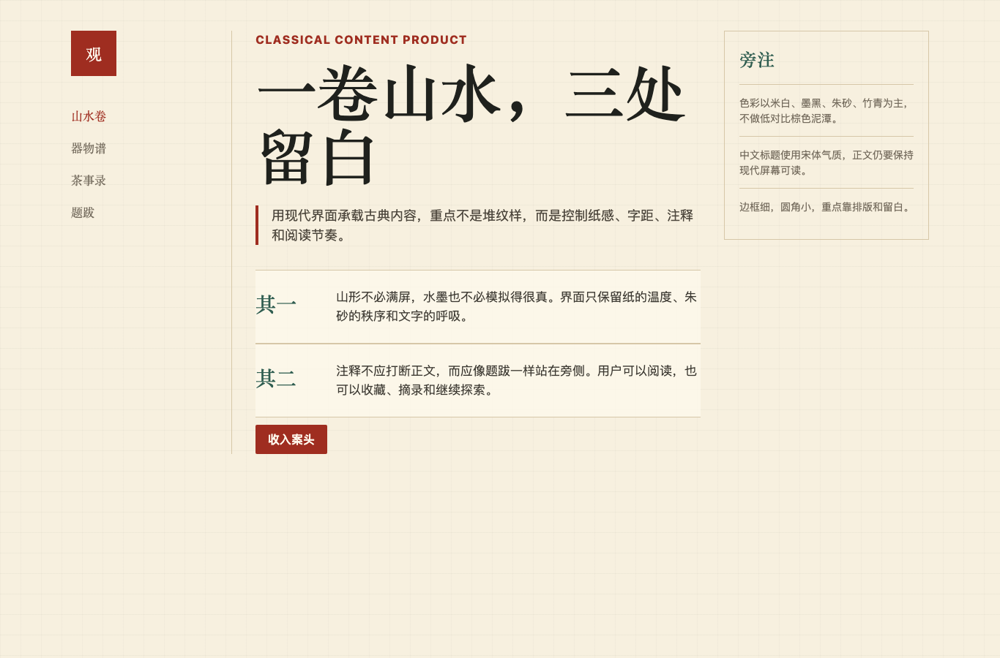
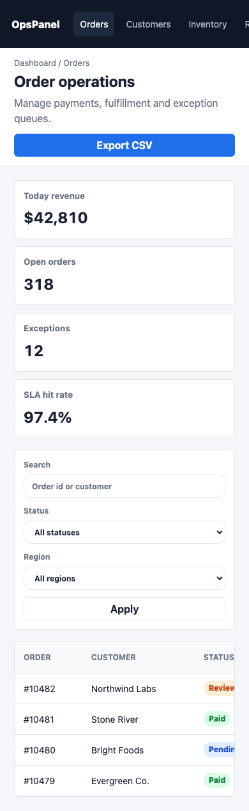

# UI Design System Skill

这是一个“UI 设计风格技能”。

当你用 AI 编程助手做软件时，可以先告诉它：**我要用什么风格**。然后让它使用这个技能，按照对应的审美、页面结构和组件规范来做界面。

简单说：  
**你负责说清楚产品和风格，AI 负责编写更好看、更统一的界面。**

## 怎么使用

### 第一步：安装

把这个仓库里的 `skills/ui-design-system` 放到你的技能目录里。

如果你不确定怎么安装，可以直接把下面这句话发给你的 AI 编程助手：

```text
请帮我把这个仓库里的 skills/ui-design-system 安装成可用技能。
```

### 第二步：开发时这样说

在你让 AI 开发页面或软件前，先说：

```text
使用 $ui-design-system。
```

然后告诉它三件事：

1. 你要做什么软件
2. 你想要什么风格
3. 你希望先做哪个页面

比如：

```text
使用 $ui-design-system。
我要做一个 AI 代码审查工具。
风格用现代 SaaS / AI 工具风格。
请先做首页工作台。
```

再比如：

```text
使用 $ui-design-system。
我要做一个中式古典风格的文旅内容产品。
重点是宣纸、宋体、朱砂、留白和阅读感。
请先做首页和文章页。
```

## 不知道选什么风格怎么办

你可以这样问：

```text
使用 $ui-design-system。
我要做一个个人效率软件，但我不知道适合什么 UI 风格。
请给我 3 个风格方向，并说明适合原因。
```

选好后再继续开发：

```text
我选择 Apple-like 风格。
请按这个风格继续设计并实现页面。
```

## 当前支持的常用风格

- **现代 SaaS / AI 工具风格**：适合 AI 工具、开发者工具、后台工作台
- **Apple-like 风格**：适合个人效率、日程、创作者工具
- **企业后台风格**：适合 CRM、订单系统、管理后台、数据看板
- **中式古典风格**：适合文旅、茶、书法、古籍、内容产品
- **杂志 / 内容风格**：适合博客、作品集、研究报告
- **高端品牌风格**：适合高端服务、品牌官网、作品展示
- **新粗野主义风格**：适合年轻化、创意类、实验性产品
- **数据 / 金融风格**：适合财务、交易、分析、指标监控
- **健康 / 平静风格**：适合健康、心理、冥想、生活方式产品
- **工业控制台风格**：适合监控、运维、IoT、工程系统

完整说明在 [风格谱系](./docs/UI_STYLE_TAXONOMY.md)。

## 推荐说法

你可以把下面这段当作模板：

```text
使用 $ui-design-system。
我要做【产品类型】。
用户是【目标用户】。
风格用【风格名称】。
请先做【页面名称】。
要求页面真实可用，不要只做展示页。
```

例子：

```text
使用 $ui-design-system。
我要做一个面向独立开发者的项目管理工具。
用户是一个人做产品的开发者。
风格用现代 SaaS / AI 工具风格。
请先做项目列表页和项目详情页。
要求页面真实可用，不要只做展示页。
```

## 看看效果

可以直接打开 [examples/index.html](./examples/index.html) 查看样例。

### 现代 SaaS / AI 工具风格



### Apple-like 风格



### 中式古典风格



### 企业后台风格



## 这个技能会做什么

它会帮助 AI：

- 先确认软件适合什么风格
- 不要做千篇一律的普通页面
- 页面要像真实软件，而不是宣传海报
- 按风格选择颜色、字体、间距、圆角和布局
- 考虑按钮、表单、表格、弹窗、空状态、加载状态、错误状态
- 做完后检查桌面和手机上的显示效果

## 仓库里有什么

- [skills/ui-design-system](./skills/ui-design-system)：真正的技能目录
- [docs/UI_STYLE_TAXONOMY.md](./docs/UI_STYLE_TAXONOMY.md)：风格说明
- [docs/UI_COMPONENT_SPEC.md](./docs/UI_COMPONENT_SPEC.md)：组件规范
- [docs/UI_PROMPTS.md](./docs/UI_PROMPTS.md)：可复制的提示词
- [examples](./examples)：HTML 样例页面
- [screenshots](./screenshots)：样例截图

## 参考来源

这个规范参考了常见开源 UI 体系的思路，包括：

- [shadcn/ui](https://github.com/shadcn-ui/ui)
- [Radix Primitives](https://github.com/radix-ui/primitives)
- [Headless UI](https://github.com/tailwindlabs/headlessui)
- [Mantine](https://github.com/mantinedev/mantine)
- [Ant Design](https://github.com/ant-design/ant-design)
- [MUI](https://github.com/mui/material-ui)
- [HeroUI](https://github.com/heroui-inc/heroui)
